# SGS — Classroom Support & Operations Platform

> **Programación Intermedia** bootcamp capstone · Team project

SGS is a full-stack web platform for managing auxiliary staff walkthroughs across educational buildings. Administrators configure infrastructure, shifts, work sheets, and schedules; auxiliaries execute room-by-room visits during live shifts, recording teacher attendance, audiovisual usage, incidents, and support requests. The result is a traceable operational trail with analytics and exportable reports.

**Live demo:** [sgs-utb.vercel.app/login](https://sgs-utb.vercel.app/login) — login required; the experience depends on whether the account is an **administrator** or an **auxiliary**.

| | |
|---|---|
| **Frontend** | [github.com/luis20072002/sgs-utb](https://github.com/luis20072002/sgs-utb) (this repo) |
| **Backend** | [github.com/luis20072002/bootcamp-backend](https://github.com/luis20072002/bootcamp-backend) (private) |


---

## Tech stack

| Layer | Technologies |
|-------|----------------|
| Frontend | Angular 21, TypeScript, Bootstrap 5, Chart.js, SheetJS, jsPDF |
| Backend | FastAPI, SQLAlchemy, Pydantic, JWT (python-jose), bcrypt |
| Database | PostgreSQL (Supabase) |
| Deployment | Vercel (frontend) · Render (API) · Supabase (database) |

---

## Architecture

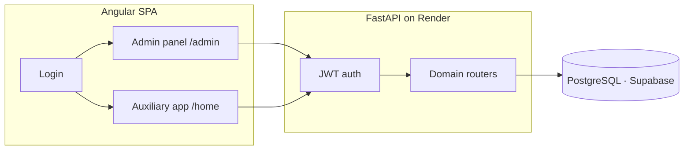

The application enforces **role-based routing** after login:

| Role | JWT `rol_id` | Route prefix |
|------|--------------|--------------|
| Administrator | `1` | `/admin/*` |
| Auxiliary | `2` | `/home/*` |

---

## Administrator experience

Screens from the admin panel (`/admin/*`). Sidebar sections: **Dashboard**, **Gestión** (management), **Operación** (operations), **Informes** (reports).

### Dashboard — system overview

Route: `/admin/dashboard`

KPI cards show active auxiliaries, registered teachers, generated work sheets, and period reports — each linking to its module. A system alerts panel surfaces pending requests, incomplete sheets, and other operational issues.

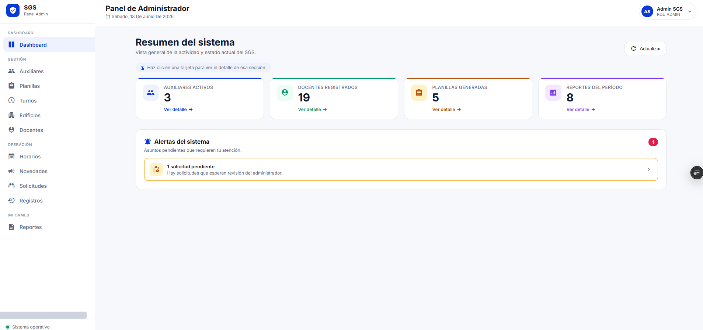

### Auxiliaries — user management

Route: `/admin/auxiliares`

Create, edit, and logically activate/deactivate auxiliary accounts. Search by name or email, filter by status, and assign each user to a building.

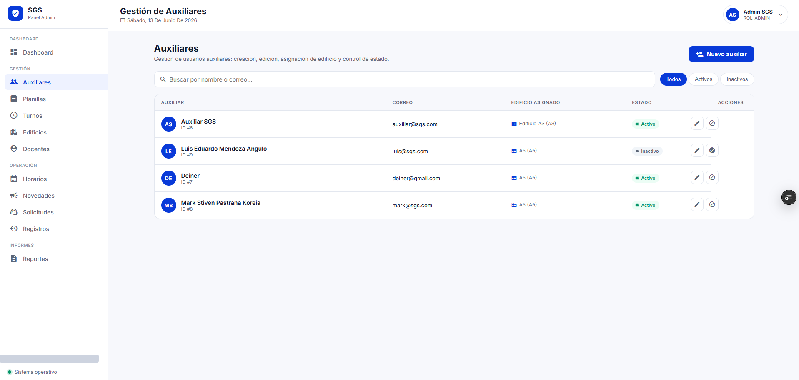

### Work sheets — shift assignments

Route: `/admin/planillas`

Manage work sheets that bind an auxiliary to a building, shift, floors, and period. Filter by building, shift, period, and status. Create new sheets through a multi-step wizard (basic data → room selection → class schedule per room).

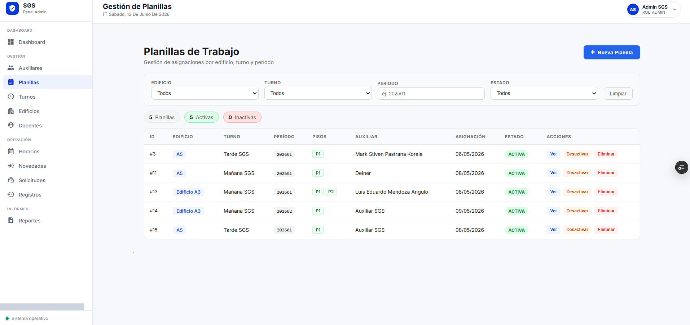

### Buildings & rooms — infrastructure

Route: `/admin/edificios`

Master-detail layout: select a building on the left, manage its rooms on the right. Supports room CRUD, floor filtering, and bulk room upload via spreadsheet.

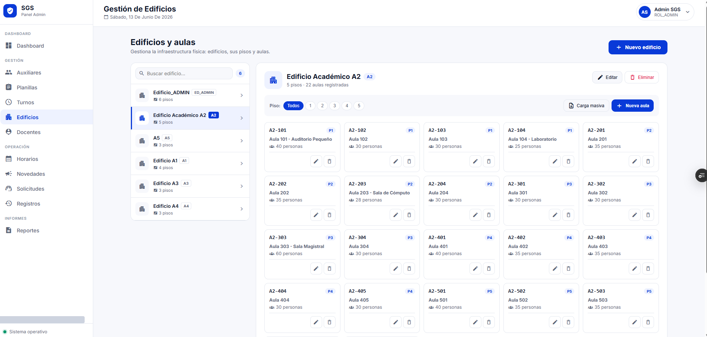

### Schedules — weekly shift assignment

Route: `/admin/horarios`

Assign weekly shifts per auxiliary on a day-by-day grid. Register exceptions (shift changes, justified absences) with date, type, and reason.

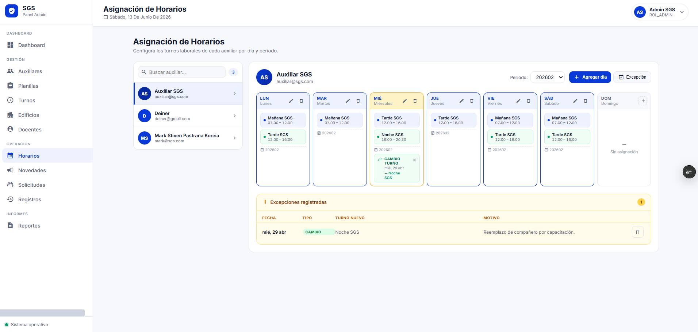

### Incidents — operational analytics

Route: `/admin/novedades`

Read-only incident log reported by auxiliaries during walkthroughs. Filter by building and date range. Charts show incidents per month, top rooms by frequency, and distribution by building.

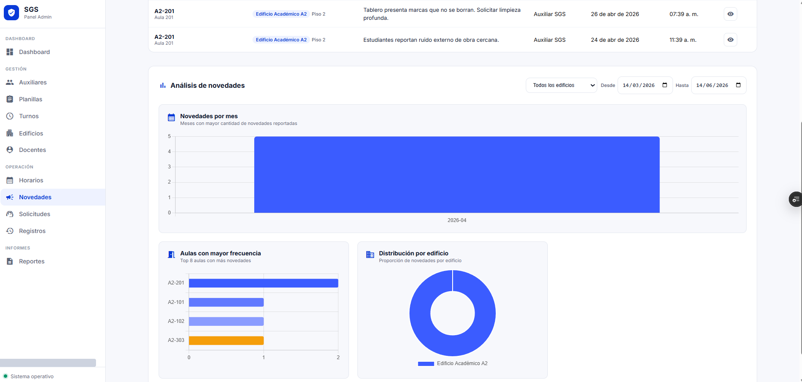

### Requests — lifecycle management

Route: `/admin/solicitudes`

View all support requests with status (pending, in progress, resolved), resolution notes, and timestamps. Analytics cover requests per month, top rooms, and status distribution.

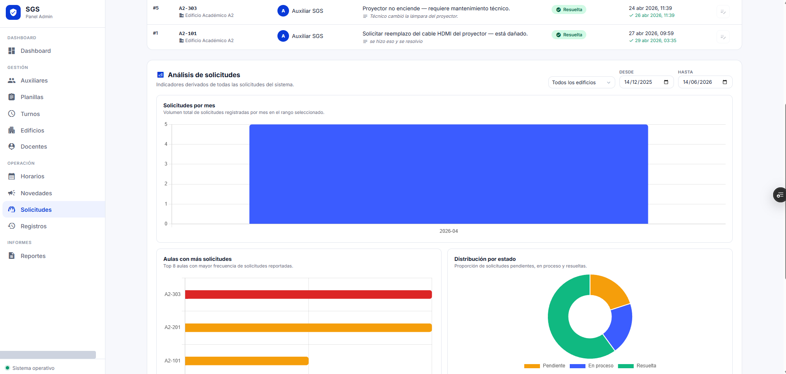

### Room records — visit audit trail

Route: `/admin/registros`

Read-only table of every room visit: building, floor, teacher, course, shift, teacher attendance, audiovisual usage, and timestamp. Summary chips show total records, attendance rate, and A/V usage rate. Period-based analysis charts below.

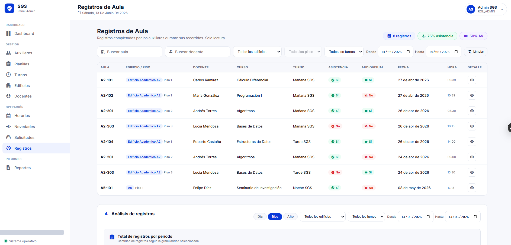

### Reports — Excel & PDF export

Route: `/admin/reportes`

Generate and download reports by type (room records, incidents, requests, teacher attendance), date range, and building. Output formats: Excel and PDF.

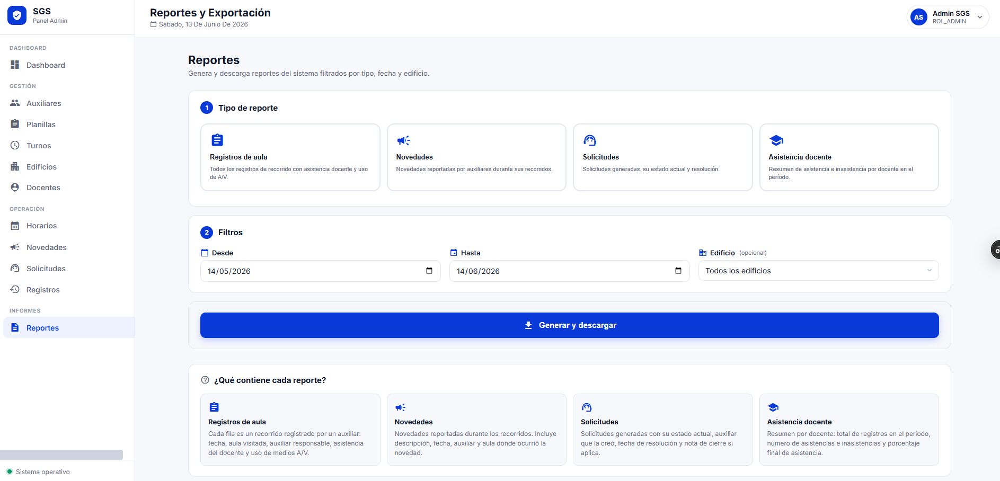

Additional admin modules (Turnos, Docentes) follow the same sidebar under **Gestión** and are documented in the [API reference](https://bootcamp-backend-qcxk.onrender.com/docs).

---

## Auxiliary experience

Screens from the auxiliary app (`/home/*`). Top navigation: **Inicio**, **Planilla**, **Solicitudes**, **Novedades**, **Horario**, **Perfil**.

### Home — shift status

Route: `/home`

When no shift is active, the dashboard shows a summary card and quick links to planilla, schedule, incidents, requests, and profile.

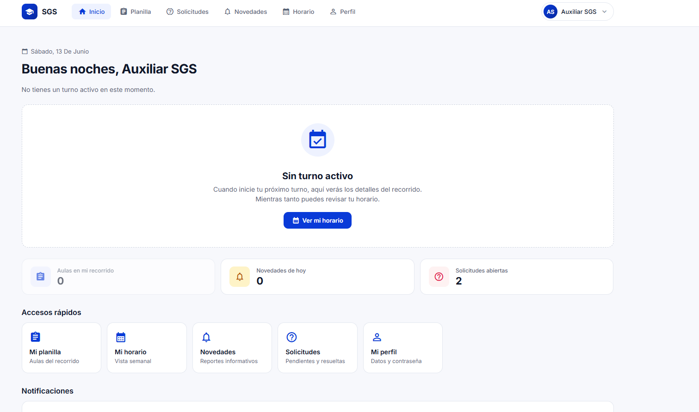

When a shift is in progress, the dashboard displays the active shift name, time window, assigned building, floors, remaining time, and a shortcut to the work sheet.

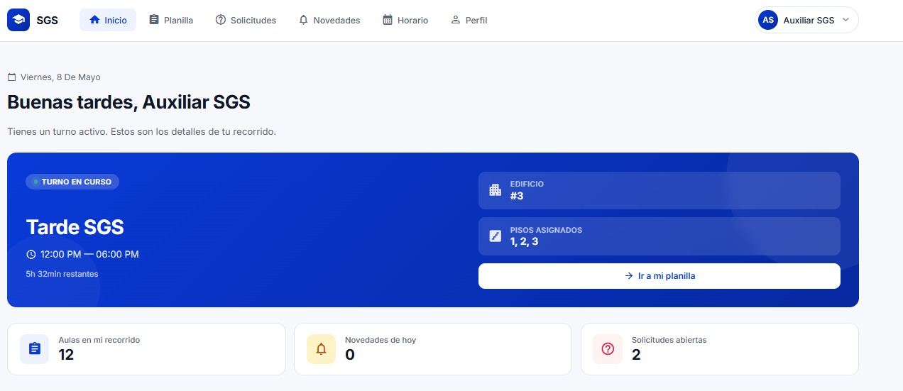

### Work sheet — room walkthrough

Route: `/home/planilla`

Shows the current shift, building, floors, and walkthrough progress (e.g. 5 of 12 rooms registered). Each room card indicates registration status, teacher presence, and A/V usage. Pending rooms expose a **Register room** action; completed rooms allow editing.

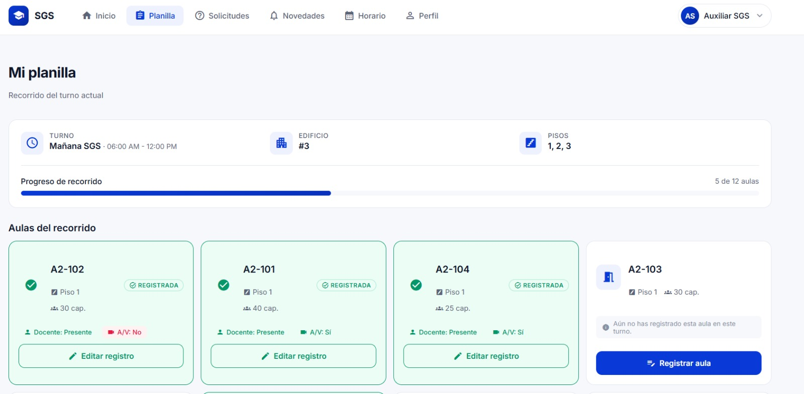

### Room registration modal

Opened from the work sheet when registering or editing a room visit.

Captures teacher attendance and audiovisual usage toggles. Optionally attach an **incident** (novedad) or **support request** (solicitud). Validates that the current time falls within the assigned shift window before saving.

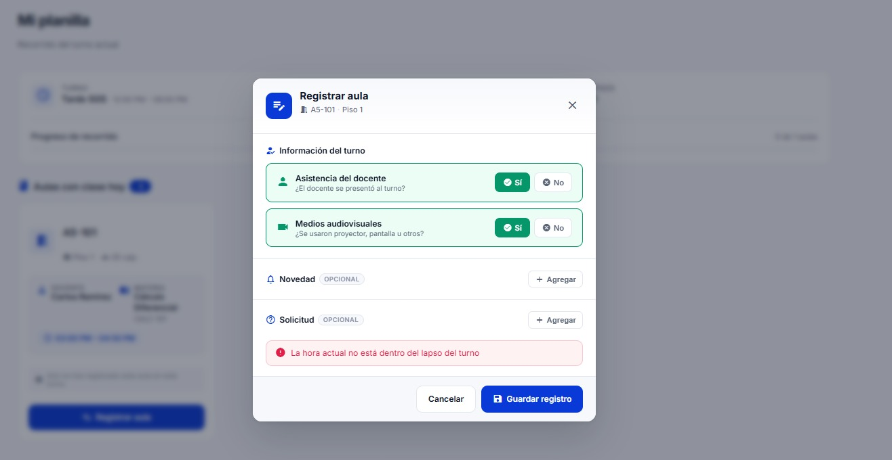

### Requests — personal ticket list

Route: `/home/solicitudes`

Tabbed view (all, pending, in progress, resolved) with date filters. Auxiliaries can mark their own requests as resolved and add a resolution note.

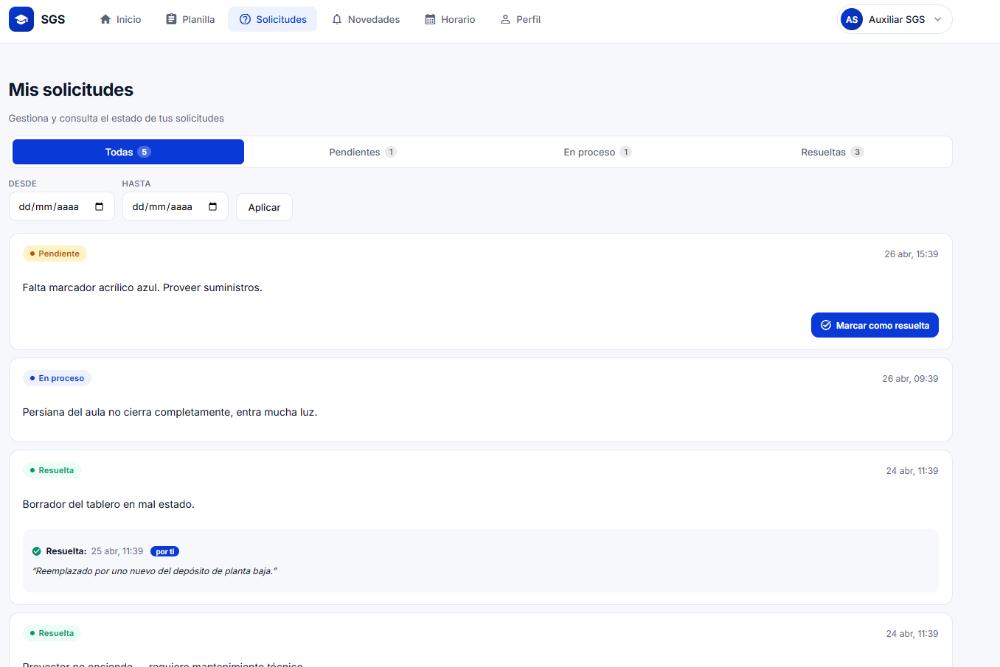

### Incidents — reported history

Route: `/home/novedades`

Chronological log of incidents the auxiliary reported during walkthroughs, grouped by date and linked to the originating room record.

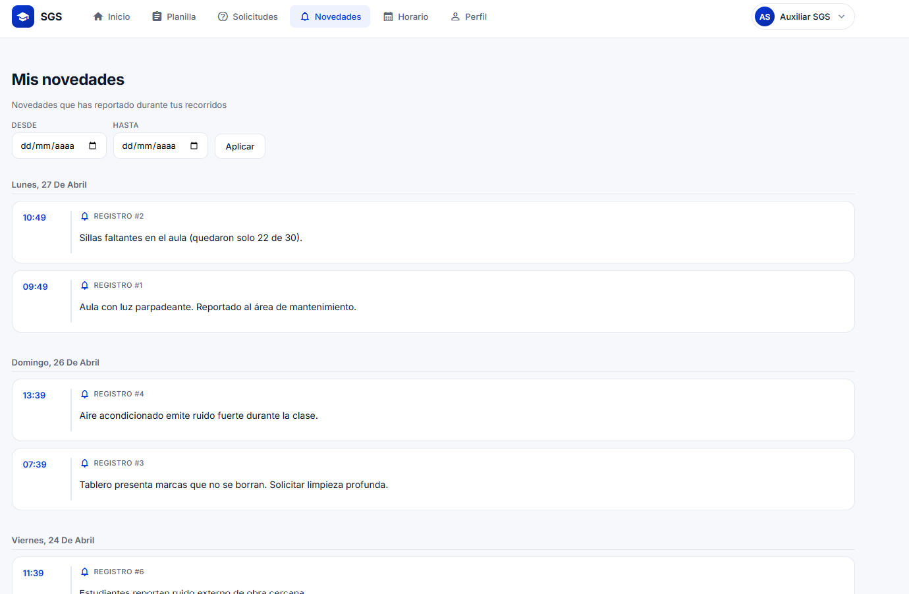

### Schedule — weekly calendar

Route: `/home/horario`

Week view (Mon–Sun) showing assigned shifts per day with period codes. Highlights the current day; empty days show no assignment. Supports exception indicators when configured by an administrator.

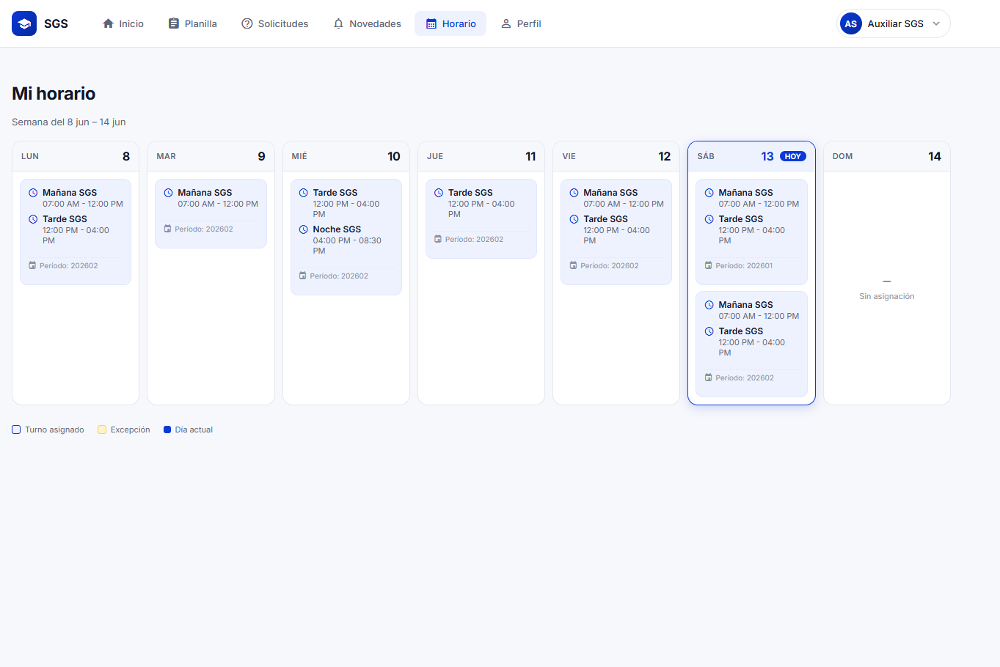

### Profile

Route: `/home/perfil`

Account details and password change (`POST /auth/change-password`).

---

## Domain model (summary)

| Entity | Purpose |
|--------|---------|
| `Edificio` / `Aula` | Buildings and rooms |
| `Turno` | Global time slots |
| `Docente` / `Curso` | Teachers and courses |
| `Planilla` | Work assignment: auxiliary + building + shift + floors + class schedule |
| `HorarioAuxiliar` | Weekly shift grid per auxiliary |
| `HorarioExcepcion` | Schedule exceptions |
| `Registro` | Per-room visit (attendance, A/V usage) |
| `Novedad` | Incident tied to a visit |
| `Solicitud` | Support request tied to a visit |

---

## Getting started

### Prerequisites

- Node.js 20+ and npm
- Python 3.11+
- PostgreSQL (or Supabase credentials)

### Frontend

```bash
cd SGS
npm install
ng serve
# http://localhost:4200
```

### Backend

The API lives in a separate private repository. To run locally:

```bash
# Clone bootcamp-backend (requires access)
pip install -r requirements.txt

# Create .env with: user, password, host, port, dbname
uvicorn api.main:app --reload
# http://127.0.0.1:8000/docs
```

Point `SGS/src/environments/environment.ts` to your API URL. Production uses `https://bootcamp-backend-qcxk.onrender.com`.

---

## Team

Capstone project developed collaboratively during **Programación Intermedia**.

| Name | GitHub |
|------|--------|
| Luis Eduardo Mendoza | [@luis20072002](https://github.com/luis20072002) |
| Deiner De Jesus Gonzalez | [@dei0811](https://github.com/dei0811) |
| Mark Pastrana Koreia | [@EtienneGW](https://github.com/EtienneGW) |

---

## Links

- **Live app:** [sgs-utb.vercel.app](https://sgs-utb.vercel.app/login)
- **Frontend repo:** [github.com/luis20072002/sgs-utb](https://github.com/luis20072002/sgs-utb)
